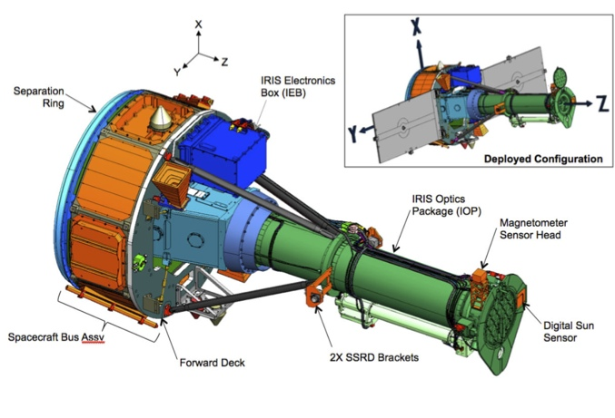
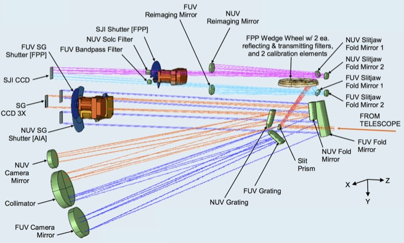

.. _irispy-iris:

*************
What is IRIS?
*************

IRIS
====

**Interface Region Imaging Spectrograph (IRIS)** is a NASA Small Explorer (SMEX) satellite.
With the mission statement of the IRIS mission being to combine advanced numerical modeling with a high resolution, high throughput multi-channel UV imaging spectrograph fed by a 20 cm UV telescope.
Whereas the main science goal of IRIS is to understand how the solar atmosphere is energized and to understand the mass and energy flow through the chromosphere and transition region.
IRIS data is also used for a wide range of other science topics including: solar flares, prominences, sunspots, coronal rain, spicules, and more.

IRIS obtains UV spectra and images in two main passbands around 1400 Å and 2800 Å at high resolution in space (0.33-0.4"), time (~1s) and spectrally (~26 and ~53 mÅ respectively) that are focused on the chromosphere and transition region including some coverage in the corona.

   Schematic view of IRIS showing the 20 cm UV telescope, with and without solar panels (for clarity).
   Light from the Cassegrain telescope (green) is fed into the spectrograph box (light blue).

   Schematic diagram of path taken by light in the FUV spectrograph (dark blue), NUV spectrograph (orange), FUV slit-jaw (light blue) and NUV slit-jaw (purple) path.

The IRIS telescope feeds light from three passbands into the spectrograph box:

* Far Ultraviolet (FUV1): 1331.56--1358.40 Å
* Far Ultraviolet (FUV2): 1390.00--1406.79 Å
* Near Ultraviolet (NUV): 2782.56--2833.89 Å

In the spectrograph, the light follows several paths either:

* Spectrograph (SG): passing through a slit that is 0.33 arcsec wide and 175 arcsec long, onto a grating that is sensitive in both FUV and NUV passbands, then onto 3 CCDs to produce spectra in three passbands (FUV1, FUV2, NUV; :ref:`Table 1 <iris_table1>`)
* Slit-Jaw Imager (SJI): reflected off the reflective area around the slit ("slit-jaw"), passing through or reflected off broadband filters on a filterwheel, then onto 1 CCD to produce an image of the scene around the slit (slit-jaw = SJI) in 6 different filters (2 for calibration, 4 for solar images, :ref:`Table 2 <iris_table2>`)

Exposure times are controlled by 3 different shutters (FUV, NUV and SJI).
Light is collected onto 4 CCDs which are read out by 2 cameras and which cover 3 different spectral bands and the slit-jaw images (:ref:`Table 1 <iris_table1>`, :ref:`2 <iris_table2>`).
The IRIS spectral lines cover temperatures from 4,500 K to 10 MK, with the images covering temperatures from 4,500 K to 65,000 K (and possibly 10 MK under flaring conditions).
`IRIS Technical Note 1 <https://www.lmsal.com/iris_science/doc?cmd=dcur&proj_num=IS0109&file_type=pdf>`__ provides more technical details on IRIS.

.. _iris_table1:

.. table:: Table 1. Overview of spectrograph (SG) channels. These are imaged onto 3 identical 1096 x 2072 pixel CCDs and can all be simultaneously read using two different camera electronics boards (CEB). Ranges, dispersion and effective area are current best estimates based on pre-launch measurements. Spatial pixel size is 0.166", and the maximum spatial extent is 175".

   =====  ==============  ===================  =============================  ===================
   Band   Wavelength (Å)  Dispersion (mÅ/pix)  Effective area (cm\ :sup:`2`)  Temperature (log T)
   =====  ==============  ===================  =============================  ===================
   FUV 1  1331.7--1358.4  12.98                1.6                            3.7--7.0
   FUV 2  1389.0--1407.0  12.72                2.2                            3.7--5.2
   NUV    2782.7--2851.1  25.46                0.2                            3.7--4.2
   =====  ==============  ===================  =============================  ===================

.. _iris_table2:

.. table:: Table 2. Overview of slit-jaw (SJI) channels. Slit-jaw passbands are chosen using a filterwheel. The light is imaged onto one 2072x1096 pixel CCD with only one passband exposed/read-out at one time. Read-out is done with the same CEB as NUV SG. Ranges, full width half max (FWHM), and effective areas of the passbands are best estimates based on pre-launch measurements. SJI passband types are either mirrors (M) or transmission filter (T). Spatial pixel size is 0.166", and the spatial range is 175"x175".

   ============  ====  ==============  ========  =============================  ================
   SJI Passband  Type  Wavelength (Å)  FWHM (Å)  Effective area (cm\ :sup:`2`)  log T
   ============  ====  ==============  ========  =============================  ================
   Glass           T        5000          2000        --                        --
   C II            M        1330            40        0.5                       3.7--7.0
   Si IV           M        1400            40        0.6                       3.7--5.2
   Mg II h/k       T        2796             4        0.005                     3.7--4.2
   Mg II wing      T        2832             4        0.004                     3.7--3.8
   Broad-band      M        1600           400        --                        --
   ============  ====  ==============  ========  =============================  ================

IRIS Data Level Definitions
===========================

The convention on IRIS Data Levels is shown in :ref:`table 3 <iris_table3>` and at length in `IRIS Technical Note 11 <https://www.lmsal.com/iris_science/doc?cmd=dcur&proj_num=IS0076&file_type=pdf>`__.
Raw spacecraft telemetry is converted into Level 0 image files.
Level 1 images are reoriented so that wavelength increases left to right.
This constitutes the lowest level of scientifically-useful data, however since it is uncalibrated, :ref:`Level 2 <iris_lev2>` is the correct data product for most analyses.

The type of processing for data Levels beyond 1 is dependent on whether the data is from the slit-jaw imager or spectrographs.
Darks and pedestal offsets are removed, and flat-fielding corrections for telescope and CCD properties are applied to generate Level 1.5 data.
The data at Level 1.5 has had the geometric and wavelength corrections applied and the images are mapped to a common spatial plate scale.
Spectral images are remapped to align with an equal-sized array where wavelength and spatial coordinates align with the grid.
An array mapping the wavelength axis to physical wavelength is created in this process.
As with AIA, equivalent procedures to those used internally to transform level 1 to level 1.5 are distributed via SolarSoft as `iris_prep.pro <http://sohowww.nascom.nasa.gov/solarsoft/iris/idl/lmsal/calibration/iris_prep.pro>`__.

Levels 2 and 3 are generated from Level 1 or Level 1.5 data and are reorganized so that they can be analyzed using tools adapted from Hinode/EIS and SST/CRISP.
Level 2 data consists of sets of 3D image extensions of each wavelength band stored as (λ,x,y) assembled from rasters of NUV and FUV Level 1.5 data.
Level 3 data exist only for spectral rasters, and are 4D datacubes stored as (x,y,λ,t).

.. note::

   **Level 1 vs. level 2 data:**
   The spectral data of IRIS is distinct from many contemporary observatories like SDO.
   IRIS Level 2 data is equivalent to Level 1 data products of those other observatories.
   The Level 2 data are fully reduced, calibrated, etc. and packaged such that they are "shovel ready" for further analysis.
   On the other hand IRIS Level 1 data **MUST** be passed through the calibration routines `iris_prep.pro <http://sohowww.nascom.nasa.gov/solarsoft/iris/idl/lmsal/calibration/iris_prep.pro>`__ by an expert user to reach only level 1.5.
   The transition from level 1.5 to level 2 is a non-trivial exercise in packaging the data and while the code is available, it is currently not being supported for general use.
   **Therefore, we strongly recommend that the non-expert or casual IRIS users use the Level 2 data products**.

.. _iris_table3:

.. table:: Table 3. IRIS data level descriptions.

   =====  ===========================================  ==========================================
   Level  Processing                                   Notes
   =====  ===========================================  ==========================================
   TLM    | Capture                                    | Raw telemetry
   0      | Depacketized                               | Raw images with basic keywords
   1      | Reorient images to common axes:            | Lowest distributed level
          | North up (0° roll),
          | increasing wavelength to right
   1.5    | Dark current and offsets removed           | Transitory data product for level 2
          | Flag bad pixels and spikes pixels          | production. Not distributed,
          | Flat-field correction                      | for internal use only.
          | Geometric and wavelength calibration
   1.6    | Physical units (exposure and photon        | Not distributed.
          | conversion)
   **2**  | **Recast as rasters and SJI time series**  | **Standard science product.**
                                                       | **Scaled and stored as 16-bit images**
   3      | Recast as 4D cubes for NUV/FUV spectra     | ``CRISPEX`` format
   HCR    | Description of observing sequences         | Ingested by HCR at LMSAL.
                                                       | To be searched by VSO, etc.
   =====  ===========================================  ==========================================
