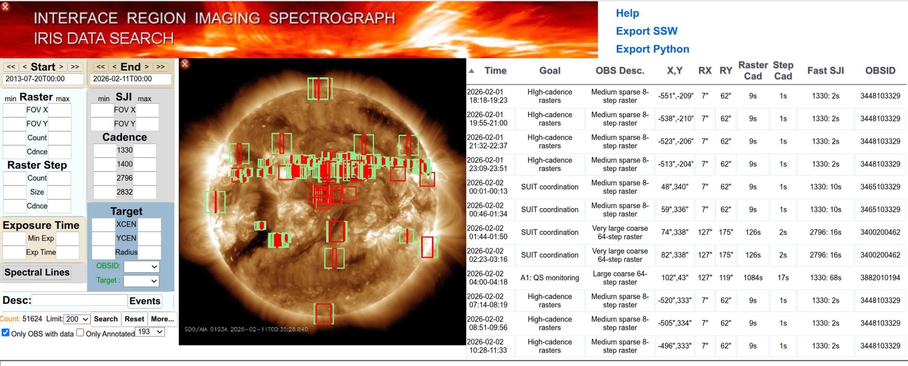
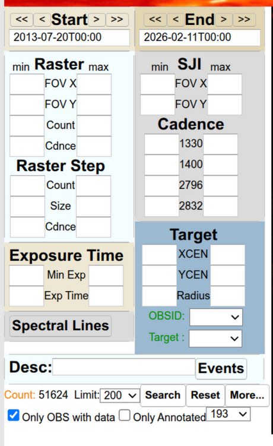
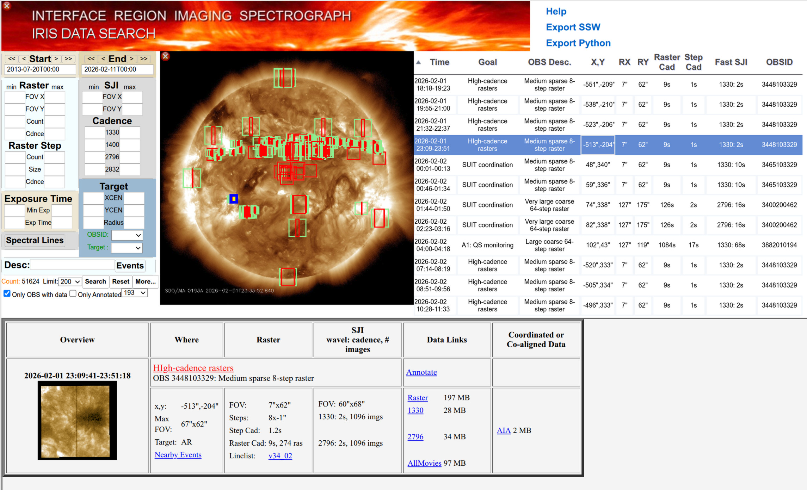
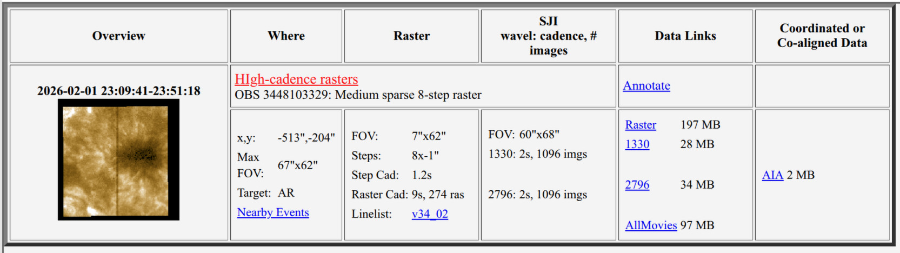

.. _irispy-tutorial-acquiring-data:

**************
Acquiring Data
**************

This section of the tutorial will introduce methods to obtain IRIS data from two different places.
The main section will focus on using the IRIS data search tool from the official IRIS website.
But we will also cover the `~sunpy.net.Fido` interface for searching and downloading data from a variety of different sources, including IRIS data from the Virtual Solar Observatory (VSO).

IRIS data search website
========================

The `IRIS data search webpage <https://iris.lmsal.com/search/>`__ is designed to quickly guide researchers to IRIS datasets appropriate for their research.
It consists of five graphical elements and three steps to the data:

#. IRIS Banner
#. Selection widgets
#. Graphical display of search results on a SDO/AIA image
#. Tabular display of search results
#. Dataset browser/inspector with links to download the datasets

The IRIS data search tool is optimized for use on landscaped displays of at least 1280x768 pixels.
The banner and the solar image can be hidden (displayed) by clicking on the red (green) buttons in the upper left corners to accommodate smaller screens.
The data search tool has been tested with recent versions of Firefox, Safari and Chrome browsers.
If you have difficulty with the tool, you might first try one of these browsers to ensure compatibility.

**Selection widgets**

There are six widgets available for customized dynamic data searches.
At the most basic, this search consists of specifying the **start** and **end** of a time range of interest.
When first loaded, these default to select the week surrounding the current date.
The **start** and **end** times can be moved forward and back a day or a week by using the single and double arrow buttons.
Specific dates can be entered directly into the text boxes or by using the calendars that popup when one clicks on them.
The total **count** of datasets available within the time range appears at the bottom left of this selection area.
By default, only datasets that are completely processed are displayed.
If you wish to include ones that are still processing, uncheck the **only OBS with data** box below **count** (not shown in figure).

The remaining widgets are used to filter the selections within the specified time range.
The **count** of available data sets updates dynamically to reflect the effects of your selections.

**Raster**:
Limit results to datasets with rasters within a (**min**, **max**) range of: fields of view in arcseconds; number of repeats (**count**); and of the **cadence** in seconds and with raster steps within a range of number (**count**); size in arcseconds and **cadence** in seconds.

**Slit Jaw Imager (SJI)**:
Limit results to datasets with slit jaw images within a range of fields of view and **cadences** for each wavelength band.

**Exposure time**:
Limit results to datasets within a range of minimum exposure and mean exposure times based on all images within the dataset.

**Target**:
Limit results to a range of target positions relative to disk center in arcseconds either as a bounding box (**xcen**, **ycen**) or an annulus between radii.
Limit sets to specific IRIS Observation IDs or **target**.
The colors of these last two change to indicate the presence (green) or absence (red) of matching datasets based upon other selections.

When all selections are made, clicking the search button refreshes the results in the display area.
**Note that the display does not update while you are constructing a search.**
A range of background SDO/AIA images of the sun corresponding to the start time of query can be selected for the display.
All filters (other than dates) and displays are cleared by clicking the reset button.

**Display Widget**:
The results of a search are displayed on a co-temporal AIA image that is selectable from the search widget.
The default setting displays the bounding boxes for the slit jaw (raster) image as green (red) rectangles on an 193 Å AIA image.
A sortable list of IRIS observations on the right presents details of the dataset including the time interval, short descriptions, pointing, fields of view, cadences and observation IDs.
Clicking on an entry in either widget, highlights the selection in the table along with a detailed description in the inspection widget.

**Inspection Widget**:
The inspection widget shows more details of the dataset, including a thumbnail slit jaw image, pointing information and links to and sizes of the data products (when they become available).
Clicking on the image or title will bring up a separate details page with summary movies, paths to the data and links to the AIA cutout service.
Clicking on the data links will immediately download the corresponding gzipped dataset.

Co-aligned data
---------------

The latest version of the search engine includes the option to find all IRIS observations for which co-aligned SDO and/or Hinode data cubes are available.
This can be done by checking the appropriate option buttons located under the "More" button.
The co-aligned data is explained in detail by `ITN32 <https://iris.lmsal.com/itn32/introduction.html>`__.

`~sunpy.net.Fido`
=================

Now we will describe how to search for and download IRIS data using sunpy's `~sunpy.net.Fido`.
`~sunpy.net.Fido` is a unified interface for searching and fetching solar physics data irrespective of the underlying client or web service through which the data is obtained.
This is not a general tutorial for `~sunpy.net.Fido`, please read :ref:`sunpy-tutorial-acquiring-data-index` for a more in depth introduction to using `~sunpy.net.Fido` to search for and download data from a variety of different sources.

The following examples here will use ``Fido``, so lets start by importing it:

.. code-block:: python

    >>> import astropy.units as u

    >>> from sunpy.net import Fido, attrs as a

Searching for data
------------------

To search for data with `~sunpy.net.Fido`, you need to specify attributes to search with.
For IRIS data, the most important attribute is `a.Time <sunpy.net.attrs.Time>` and `a.Instrument.iris <sunpy.net.attrs.Instrument>`.

Some search attributes need one or more values specifying, for example ``Time`` needs at least a start and an end date to specify a time range:

.. code-block:: python

    >>> a.Time('2020/3/4', '2020/3/5')
    <sunpy.net.attrs.Time(2020-03-04 00:00:00.000, 2020-03-05 00:00:00.000)>

To search for data use the ``Fido.search`` method:

.. code-block:: python

    >>> result = Fido.search(a.Time('2020/3/4', '2020/3/4'), a.Instrument.iris) # doctest: +REMOTE_DATA

this returns an `~sunpy.net.fido_factory.UnifiedResponse` object containing all the search results that match the search attributes.
This does not download the files.
To see a summary of the results print the result variable that came back from the previous search:

.. code-block:: python

    >>> print(result)  # doctest: +REMOTE_DATA
    Results from 1 Provider:
    <BLANKLINE>
    4 Results from the VSOClient:
    Source: https://sdac.virtualsolar.org/cgi/search
    Data retrieval status: http://docs.virtualsolar.org/wiki/VSOHealthReport
    Total estimated size: 2.375 Gbyte
    <BLANKLINE>
           Start Time               End Time        Source Instrument    Wavelength    Provider  Physobs  Wavetype     Extent X         Extent Y       Extent Width   Extent Type  Size
                                                                          Angstrom                                                                                                Mibyte
    ----------------------- ----------------------- ------ ---------- ---------------- -------- --------- -------- ---------------- ---------------- ---------------- ----------- ------
    2020-03-03 22:53:35.000 2020-03-04 01:59:14.000   IRIS       IRIS 1332.0 .. 2835.0    LMSAL intensity   NARROW 790.775695800781 16.8814430236816 230.227996826172 PARTIAL_SUN 2019.0
    2020-03-03 22:53:35.000 2020-03-04 01:59:05.000   IRIS       IRIS 2796.0 .. 2796.0    LMSAL intensity   NARROW 790.774841308594 16.8615531921387 230.227996826172 PARTIAL_SUN   88.0
    2020-03-03 22:53:38.000 2020-03-04 01:59:09.000   IRIS       IRIS 2832.0 .. 2832.0    LMSAL intensity   NARROW    790.775390625 16.8734436035156 230.227996826172 PARTIAL_SUN  104.0
    2020-03-03 22:53:41.000 2020-03-04 01:59:11.000   IRIS       IRIS 1400.0 .. 1400.0    LMSAL intensity   NARROW 790.775695800781 16.8814430236816 230.227996826172 PARTIAL_SUN   54.0
    <BLANKLINE>
    <BLANKLINE>

This shows that there are 4 results from the Virtual Solar Observatory (VSO), which is a service which indexes may solar datasets and provides access to them.
Note that the results are not from the IRIS website, but from the VSO, which is a different service and as such does not have the full set of data products available on the IRIS website.

We shall detail the returned results a bit more.
The first result is the spectrograph data, we know this for two reasons, first because the wavelength range covers the full IRIS spectrograph range, and second because the size of the file is much larger than the slit jaw images.
The other three results are slit jaw images, we know this because the wavelength range covers only a single slit jaw wavelength and the file size is much smaller than the spectrograph data.

We can also filter by other attributes, for example if we only wanted the slit jaw images we could add a filter for the wavelength:

.. code-block:: python

    >>> filtered_result = Fido.search(a.Time('2020/3/4', '2020/3/4'), a.Instrument.iris, a.Wavelength(2796*u.AA)) # doctest: +REMOTE_DATA
    >>> filtered_result # doctest: +REMOTE_DATA
    <sunpy.net.fido_factory.UnifiedResponse object at ...>
    Results from 1 Provider:
    <BLANKLINE>
    2 Results from the VSOClient:
    Source: https://sdac.virtualsolar.org/cgi/search
    Data retrieval status: http://docs.virtualsolar.org/wiki/VSOHealthReport
    Total estimated size: 2.209 Gbyte
    <BLANKLINE>
           Start Time               End Time        Source Instrument    Wavelength    Provider  Physobs  Wavetype     Extent X         Extent Y       Extent Width   Extent Type  Size
                                                                          Angstrom                                                                                                Mibyte
    ----------------------- ----------------------- ------ ---------- ---------------- -------- --------- -------- ---------------- ---------------- ---------------- ----------- ------
    2020-03-03 22:53:35.000 2020-03-04 01:59:14.000   IRIS       IRIS 1332.0 .. 2835.0    LMSAL intensity   NARROW 790.775695800781 16.8814430236816 230.227996826172 PARTIAL_SUN 2019.0
    2020-03-03 22:53:35.000 2020-03-04 01:59:05.000   IRIS       IRIS 2796.0 .. 2796.0    LMSAL intensity   NARROW 790.774841308594 16.8615531921387 230.227996826172 PARTIAL_SUN   88.0
    <BLANKLINE>
    <BLANKLINE>

But we still get the spectrograph data because it also matches the wavelength filter.
If we want to only get the raster, we can simply index the results to get just the first result, which is the spectrograph data:

.. code-block:: python

    >>> filtered_result[0][0] # doctest: +REMOTE_DATA
    <QueryResponseRow index=0>
        Start Time               End Time        Source Instrument    Wavelength    Provider  Physobs  Wavetype     Extent X         Extent Y       Extent Width   Extent Type   Size                                                          fileid
                                                                        Angstrom                                                                                                 Mibyte
            Time                    Time           str4     str4       float64[2]      str5      str9     str6        str16            str16            str16          str11    float64                                                         str117
    ----------------------- ----------------------- ------ ---------- ---------------- -------- --------- -------- ---------------- ---------------- ---------------- ----------- ------- ---------------------------------------------------------------------------------------------------------------------
    2020-03-03 22:53:35.000 2020-03-04 01:59:14.000   IRIS       IRIS 1332.0 .. 2835.0    LMSAL intensity   NARROW 790.775695800781 16.8814430236816 230.227996826172 PARTIAL_SUN  2019.0 Raster:ivo://sot.lmsal.com/VOEvent#VOEvent_IRIS_20200303_225335_3605202860_2020-03-03T22:53:352020-03-03T22:53:35.xml

Failed client errors are reported in the returned `~sunpy.net.fido_factory.UnifiedResponse` and also on the individual `~sunpy.net.base_client.QueryResponseTable` responses in the ``.errors`` attributes.

Downloading data
****************

Once you have located your files via a `Fido.search <sunpy.net.fido_factory.UnifiedDownloaderFactory.search>`, you can download them via `Fido.fetch <sunpy.net.fido_factory.UnifiedDownloaderFactory.fetch>`.
Here we'll just download the first file in the result:

.. code-block:: python

    >>> downloaded_files = Fido.fetch(filtered_result[0][1]) # doctest: +SKIP
    >>> downloaded_files # doctest: +SKIP
    <parfive.results.Results object at ...>
    ['.../iris_l2_20200303_225335_3605202860_SJI_2796_t000.fits.gz']

If any files failed to download, the progress bar will show an incomplete number of files and the `parfive.Results` object will contain a list of the URLs that failed to transfer and the error associated with them.
This can be accessed with the ``.errors`` attribute or by printing the `~parfive.Results` object:

.. code-block:: python

    >>> print(downloaded_files.errors)  # doctest: +SKIP

The transfer can be retried by passing the `parfive.Results` object back to `Fido.fetch <sunpy.net.fido_factory.UnifiedDownloaderFactory.fetch>`:

.. code-block:: python

    >>> downloaded_files = Fido.fetch(downloaded_files)  # doctest: +SKIP

doing this will append any newly downloaded file names to the list and replace the ``.errors`` list with any errors that occurred during the second attempt.
