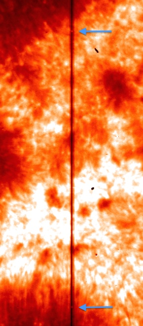
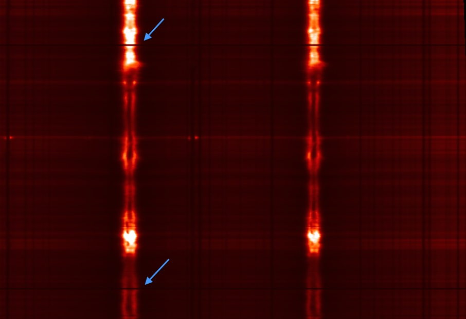

.. _irispy-tutorial-data-idiosyncrasies:

*******************
Data Idiosyncrasies
*******************

This page describes some of the particularities of IRIS data that users should be aware of when working with the data.

Background in FUV data
======================

FUV spectra with longer exposure times show a faint background most likely caused by a light leak from wavelengths significantly longer than the FUV.
This means that the light leak is absorbed at a different CCD depth than the FUV light and thus does not show the same CCD flat-field (which for the FUV is quite prominent and dominated by the CCD annealing pattern).
The light leak effectively acts as an extra "dark current" although it appears to have varying intensity levels for different pointings on the Sun.
This background has been characterized and is automatically removed by ``iris_prep.pro``, and therefore subtracted in level 1.5 and level 2 data.

Coalignment between channels and SJI & spectra
==============================================

In level 2 data the slit-jaw images from different filters and detectors are automatically co-aligned.
This automatic approach is not failsafe, and for precise analysis one should always check if they match.
There are two spectral marks on the slit that are called fiducials and block the light from entering.
They are used for calibration, and their position should match between slit-jaw images.
With smaller fields of view only one of the fiducials is visible.

.. note::

    The position of the slit in different slit-jaw channels is not necessarily the same.
    Depending on the observing program, different slit-jaw filters may be exposed at different parts of a raster.
    This is particularly true for two or four step rasters.
    In such cases the alignment should have in mind the header coordinates from ``CRPIX`` and ``CRVAL``.

    Position of fiducial marks on a slit-jaw image.

As in the slit-jaw images, so too the NUV and FUV spectrograms are co-aligned in level 2 data.
These too should be checked for the alignment, both between FUV, NUV and slit-jaws.
In spectrograms the fiducial marks appear as solid black lines along the wavelength direction, and they should appear in the same exact spatial position for the NUV and FUV channels.

    Position of fiducial marks on an NUV spectrogram.

Cosmic rays
===========

IRIS passes through the South Atlantic Anomaly (SAA) on a regular basis.
The impact of energetic particles on the CCD camera causes bright hits/pixels.
These can be removed with any of the multitude of cosmic ray removal procedures available in Python.
``irispy`` includes ``remove_cosmic_rays`` methods on SJI and raster cubes.
These methods support sliding sigma clipping via `rsliding <https://git.ias.u-psud.fr/avoyeux/rsliding>`__ and `astroscrappy <https://astroscrappy.readthedocs.io/>`__.
The example in :ref:`sphx_glr_generated_gallery_calibration_01_remove_spikes.py` focuses on the
``astroscrappy`` workflow and the tradeoffs you might encounter when applying it to IRIS data.
Cosmic rays are **not removed** from the IRIS data during normal calibration/pipeline processing to avoid introducing artifacts.

Particles on slit-jaw images
============================

The slit-jaw CCD contains some particles that cause dark regions of order up to a few arcseconds in size in the slit.
These features are marked as bad pixels and set to zero values (0) in ``iris_prep.pro`` so they can be easily recognized during data analysis.
The particles are stable in position and do not let any light through - they are completely dark.
They are most prominent in the FUV images (1400 Å and 1330 Å) and much less visible in the NUV images (2796 Å and 2830 Å).

CCD camera readout noise
========================

When both spectrograph cameras are read out simultaneously, a read interference noise pattern is superimposed on the resulting data, which can impact the weakest lines in the FUV.
The readout noise is only present when the last two digits of the OBSID are less than 50 (for the OBSID generations starting with 38,40 or 41 numbers).
This can be avoided altogether by reading the cameras sequentially, and most of the data is now observed using the sequential read (last two digits in OBSID larger than 50 for OBSID).
For OBSIDs starting with 36, those whose 4th digit are 0-4 are sequential read and those with 5-9 are simultaneous readout (3624103603 is sequential and 3629103603 is simultaneous).
Also the high-cadence flare OBSIDS 4204700126-4204700143 are simultaneous readout.

Flagging of saturated data
==========================

Some observations show strong solar activity and resulting saturation either on the CCD or (especially in OBS sequences where data is summed) in the A/D converter.
Saturated pixels are flagged as ``inf`` so they can be clearly identified.

Cosmetic finishing in quicklook movies
======================================

The quicklook movies on the IRIS website use a standard set of color tables and intensity scales that have been designed to give a consistent, recognizable and generally pleasing appearance to IRIS observations of a range of solar features.
For users who wish to replicate the appearance of off-the-shelf IRIS movies with their own processed data, you will need to do some work.

Color Tables
------------

The color tables are stored within `sunpy` and can be loaded with the `sunpy.visualization.colormaps` module.
The IRIS color tables are named 'irissji1330', 'irissji1400', 'irissji1600', 'irissji2796', 'irissji2832', 'irissji5000', 'irissjiFUV', 'irissjiNUV' and 'irissjiSJI_NUV'.
Reddish color tables are defined for the IRIS FUV slit-jaw images and spectra (the 1330 Å SJI channel uses a more yellowish-red than the 1400); yellowish tables are defined for the NUV images and spectra.

The color tables can be used in plotting routines, for example:

.. code-block:: python

    >>> import matplotlib.pyplot as plt
    >>> # Register the IRIS color tables with matplotlib
    >>> import sunpy.visualization.colormaps

    >>> cmap = plt.get_cmap('irissji1330')
    >>> cmap
    <matplotlib.colors.LinearSegmentedColormap object at ...>

This is used by default for plotting IRIS slit-jaw images with ``irispy`` plotting routines, but can be used in any plotting routine that accepts a colormap.

Intensity Scaling
-----------------

The IRIS data consists of 14-bit pixel values (DN in level 0 data can range from 0-16383; corrections applied during processing to level 2 can move the data values somewhat outside this range).

There is no Python code to automatically determine the best scaling for a given observation, but the `irispy.utils.image_clipping` routine can be used to determine good values for ``vmin`` and ``vmax`` for scaling the data in a plot.

Cleaning Up
-----------

The slit-jaw CCD contains some particles that cause dark regions of order up to a few arcseconds in size in the slit.
These features are marked as bad pixels and set to zero values (0) in ``iris_prep.pro`` so they can be easily recognized during data analysis.
The particles are stable in position and do not let any light through - they are completely dark.
They are most prominent in the FUV images (1400 Å and 1330 Å) and much less visible in the NUV images (2796 Å and 2830 Å).

These dust spots can be cosmetically corrected in slit-jaw images and movies but there is currently no routine to do this in ``irispy``.
